<picture>
  <source media="(prefers-color-scheme: dark)" srcset="./profile-dark-cat.svg">
  <source media="(prefers-color-scheme: light)" srcset="./profile-light-cat.svg">
  
</picture>

<!-- Edit profile.json, not the generated SVG files. -->
